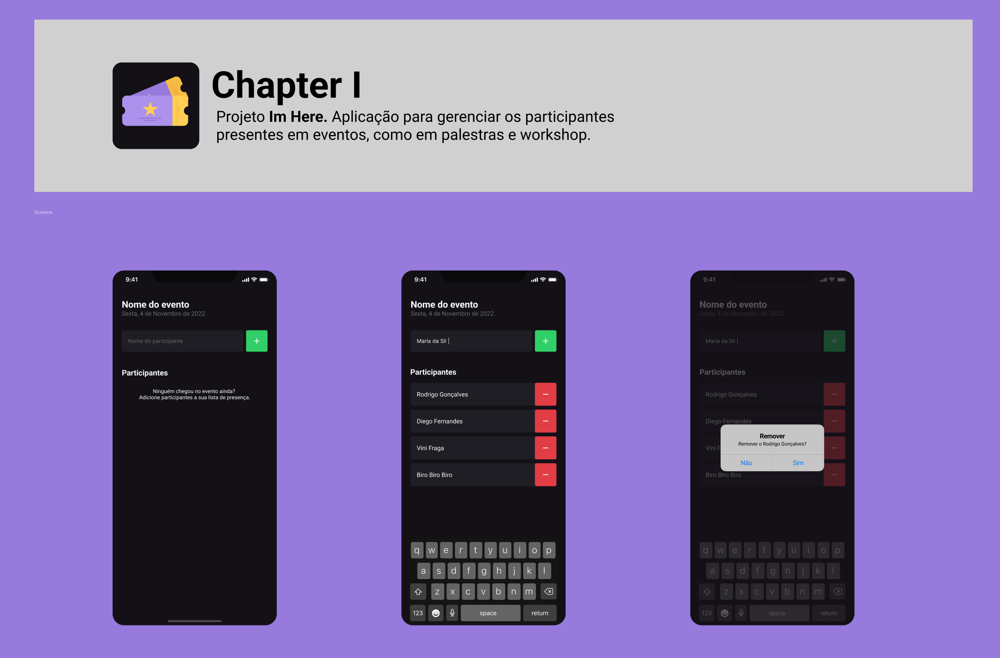

<h1 align="center">
  🙋‍♀️ I'm Here
  <hr />
  
</h1>

<p align="center">
  

  

  <a href="https://github.com/amanda-santos/imhere/commits/master">
    
  </a>

  <a href="https://github.com/amanda-santos/imhere/issues">
    
  </a>
</p>

<p align="center">
  <a href="#-about-the-project">About the project</a>&nbsp;&nbsp;&nbsp;|&nbsp;&nbsp;&nbsp;
  <a href="#-layout">Layout</a>&nbsp;&nbsp;&nbsp;|&nbsp;&nbsp;&nbsp;
  <a href="#-technologies">Technologies</a>&nbsp;&nbsp;&nbsp;|&nbsp;&nbsp;&nbsp;
  <a href="#-preview">Preview</a>&nbsp;&nbsp;&nbsp;|&nbsp;&nbsp;&nbsp;
  <a href="#-getting-started">Getting started</a>&nbsp;&nbsp;&nbsp;|&nbsp;&nbsp;&nbsp;
  <a href="#-how-to-contribute">How to contribute</a>&nbsp;&nbsp;&nbsp;
</p>

## 📝 About the project

<p>This is an app to manage participants present at events, like talks and workshops. Built for study purposes during <b>Ignite React Native</b> by <a href="https://rocketseat.com.br/">Rocketseat</a>.</p>
</p>

## 🎨 Layout

<p>
  Click <a href="https://www.figma.com/file/O97EUmoz0b5FccxiPFshMD/Chapter-I---Im-Here-(Copy)?node-id=0%3A1">here</a> to check the layout on Figma.
</p>

## 👩🏻‍💻 Technologies

Technologies used to develop this project:

- React Native
- TypeScript
- Expo

## 🖥 Preview

https://user-images.githubusercontent.com/49074930/195953284-a67f5cdc-98cd-4f8e-9d08-d6c8a0b51d3e.mp4

## ⌨ Getting started

- Run `npm i` or `yarn` to install the dependencies
- Open the application with `expo start`

## 🤔 How to contribute

**Make a fork of this repository**

```bash
# Fork using GitHub official command line
# If you don't have the GitHub CLI, use the web site to do that.

$ gh repo fork amanda-santos/imhere
```

**Follow the steps below**

```bash
# Clone your fork
$ git clone your-fork-url && cd imhere

# Create a branch with your feature
$ git checkout -b my-feature

# Make the commit with your changes
$ git commit -m 'feat: My new feature'

# Send the code to your remote branch
$ git push origin my-feature
```

After your pull request is merged, you can delete your branch

---

Made with 💜 by Amanda Santos
